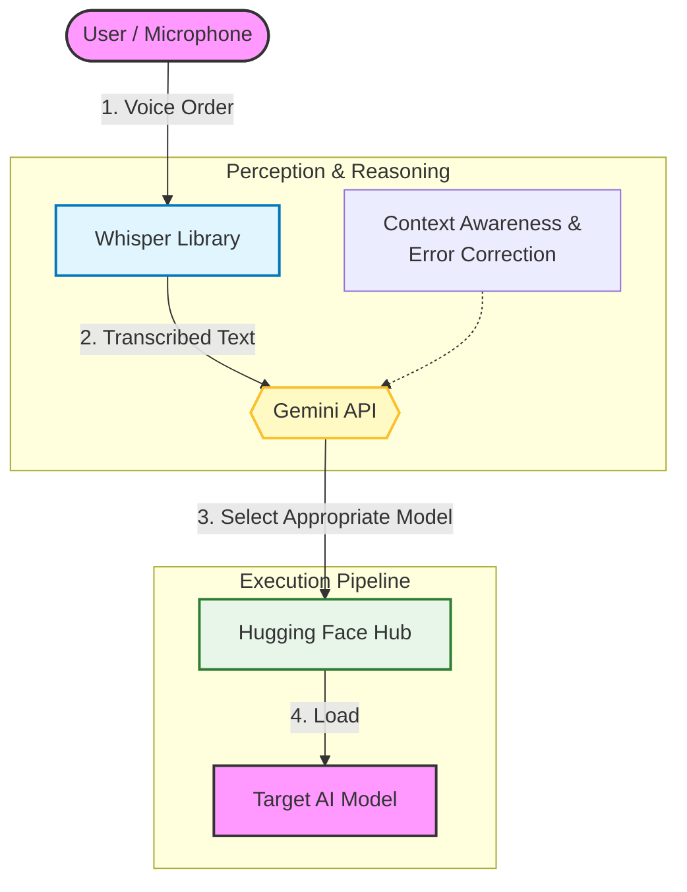

# AMD_Robotics_中野同好会(Nakano Club)  
**Title:** AMD_RoboticHackathon2025-Sushi_Master

**Team:** 中野同好会(Nakano Club)  
* 松田 侑也(Yuya Matsuda)  
* 清崎 大地(Daichi Kiyozaki)  
* 渡邉 凌大(Ryota Watanabe)  
* 高岡 充希(Mitsuki Takaoka)  

## Task Summary

- Overview
    - Sushi Serving Task
- Flow
    1. Receive sushi orders via microphone (Tuna, Egg, Tempura, Cucumber Roll)
    2. Serve dishes according to the order
        1. Tuna, Tempura, Egg:
            1. Place on sushi rice and serve on a plate
        2. Cucumber Roll:
            1. Serve directly on a plate
...

## How To Reproduce

### Prerequisites

- Python 3.10+
- USB Microphone (Device ID: 11)
- USB Cameras (overhead: index 8, wrist: index 10)
- Robot arm connected via `/dev/ttyACM0`
- Gemini API Key

### Model Input Information

- overhead camera(640✕480)
- wrist camera(640✕480)


### Setup Steps

1. **Clone the repository**
   ```bash
   git clone https://github.com/Hank-LL/AMD_Robotics_Hackathon_2025_Team27.git
   cd AMD_Robotics_Hackathon_2025_Team27/mission2
   ```

2. **Install dependencies**
   ```bash
   pip install -r requirements.txt
   ```

3. **Set environment variable for Gemini API**
   ```bash
   export GEMINI_API_KEY="your-gemini-api-key"
   ```

4. **Check device configuration**
   
   Verify your microphone and camera device IDs:
   ```bash
   # List audio devices
   python -c "import sounddevice as sd; print(sd.query_devices())"
   
   # List video devices
   ls /dev/video*
   ```
   
   Update device IDs in `code/sushi_voice_master_ui.py` if needed:
   - `MIC_DEVICE`: Microphone device ID
   - Camera indices in `cameras` parameter

5. **Run the application**
   
   **GUI Version (Recommended):**
   ```bash
   cd code
   python sushi_voice_master_ui.py
   ```
   
   **CLI Version:**
   ```bash
   cd code
   python sushi_voice_master.py
   ```

### Usage

1. Launch the application
2. Wait for the Whisper model to load (status shows "Ready to take orders!")
3. Click the "Tap to Order" button
4. Speak your order clearly (e.g., "I'd like tuna please", "I want something red")

### Available Menu Items

| Item | Description |
|------|-------------|
| 🥚 Egg | Tamago sushi |
| 🐟 Tuna | Maguro sushi |
| 🥒 Cucumber Roll | Kappa maki |
| 🍤 Tempura (Fried Shrimp) | Ebi tempura |

**Delivery URL**

Note: The robot switches models depending on the requested sushi item, so each menu entry has a dedicated dataset and model.

Datasets on Hugging Face:
- [ServeEggSushi](https://huggingface.co/datasets/HankLL/ServeEggSushi)
- [ServeTunaSushi](https://huggingface.co/datasets/HankLL/ServeTunaSushi)
- [ServeCucumberRoll](https://huggingface.co/datasets/HankLL/ServeCucumberRoll)
- [ServeTempuraSushi](https://huggingface.co/datasets/HankLL/ServeTempuraSushi)

Models on Hugging Face:
- [ServeEggSushi](https://huggingface.co/HankLL/ServeEggSushi)
- [ServeTunaSushi](https://huggingface.co/HankLL/ServeTunaSushi)
- [ServeCucumberRoll](https://huggingface.co/HankLL/ServeCucumberRoll)
- [ServeTempuraSushi](https://huggingface.co/HankLL/ServeTempuraSushi)


## System Structure

