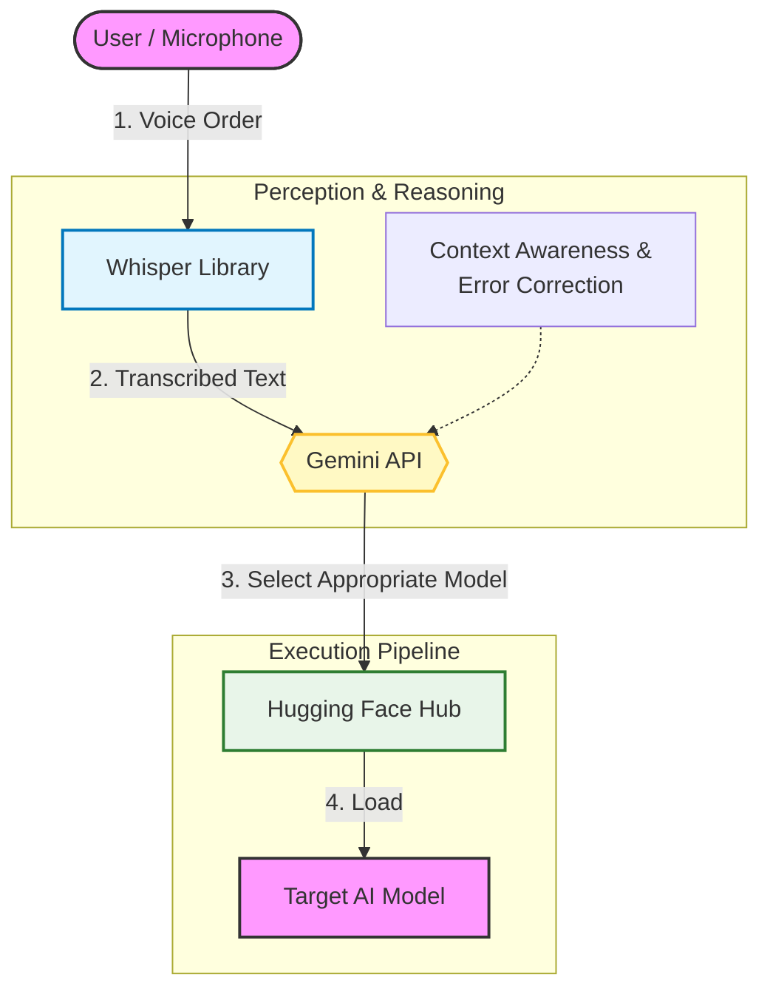

## Task Summary

- Overview
    - Sushi Chef Task
- Flow
    1. Receive sushi orders via microphone (Tuna, Egg, Tempura, Cucumber Roll, Tea Cup)
    2. Serve dishes according to the order
        1. Tuna, Tempura, Egg:
            1. Place on sushi rice and serve on a plate
        2. Cucumber Roll:
            1. Serve directly on a plate
        3. Tea Cup:
            1. Serve directly next to the plate

## Input Information

- overhead camera(640✕480)
- wrist camera(640✕480)

## System Structure

